# Анализ работы сверточной сети, распознающей цветы на фотографиях

_запущено и протестировано на Google Colab_

## Технологии
- Keras
- TensorFlow
- OpenCV 

# Модель
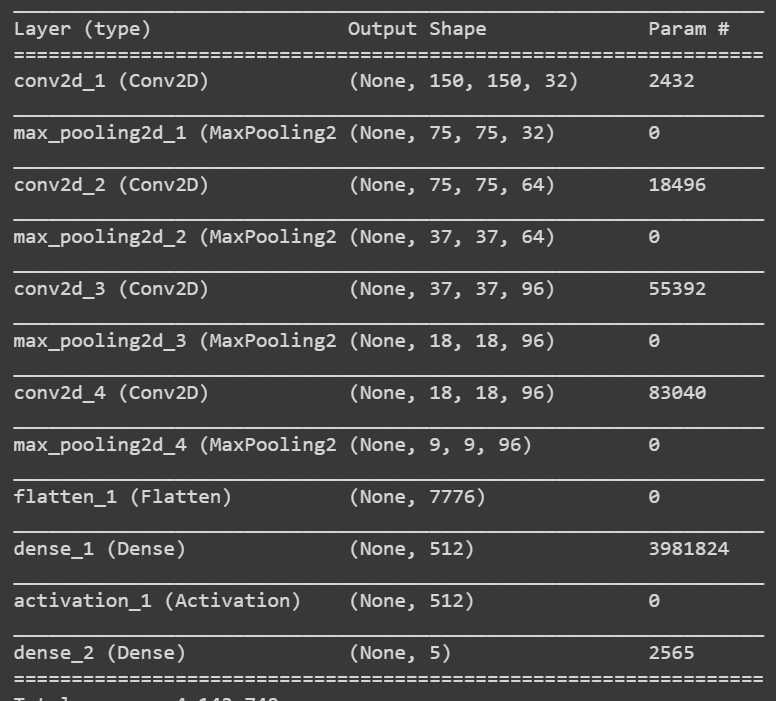

# Скриншоты

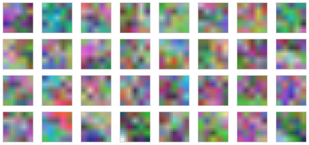
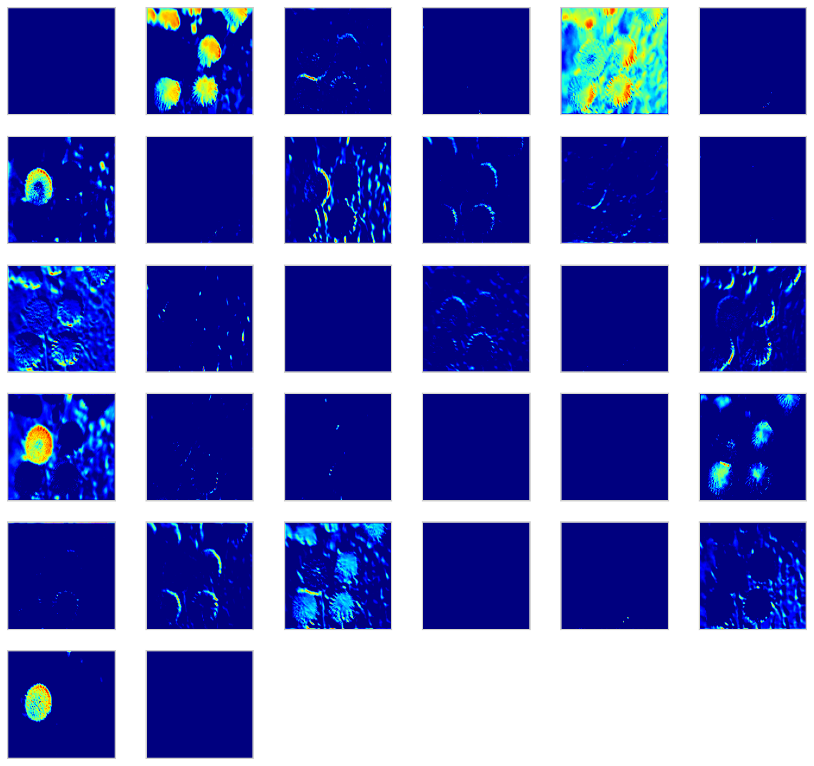
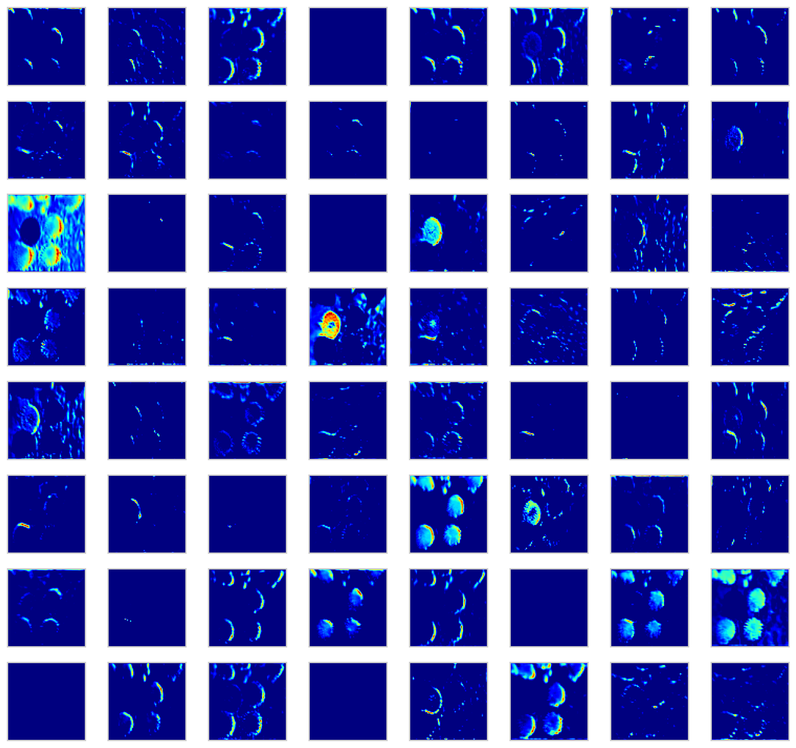
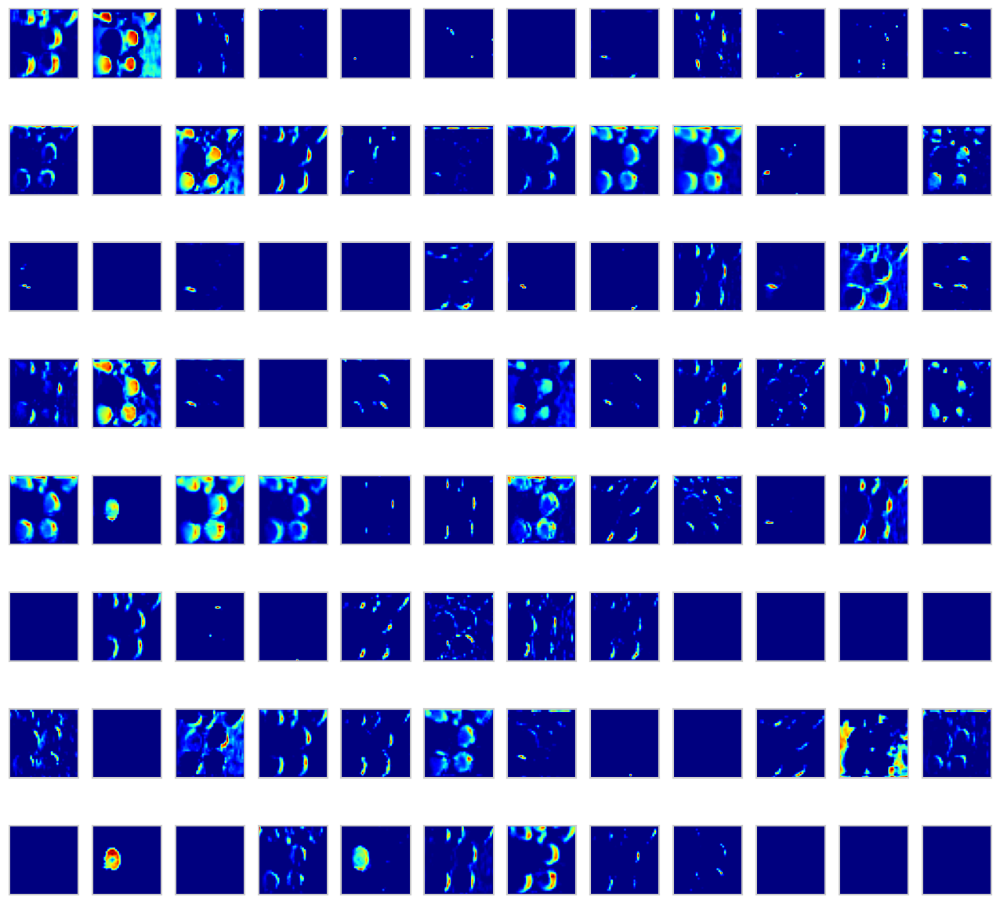
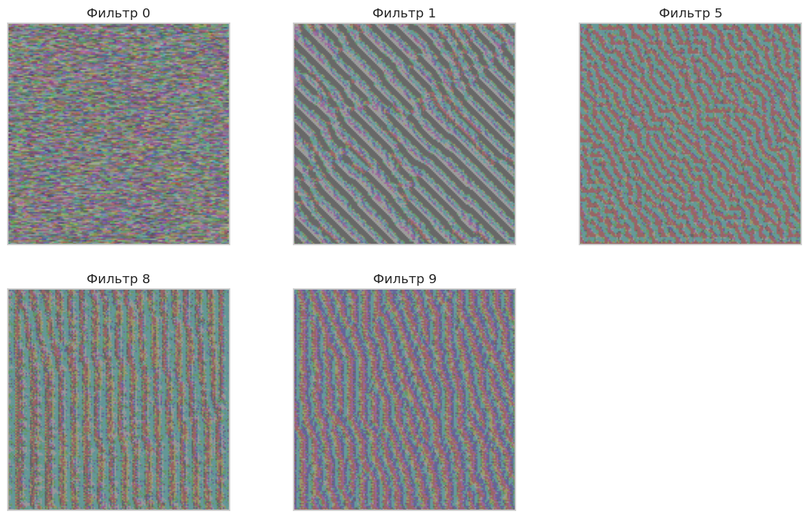
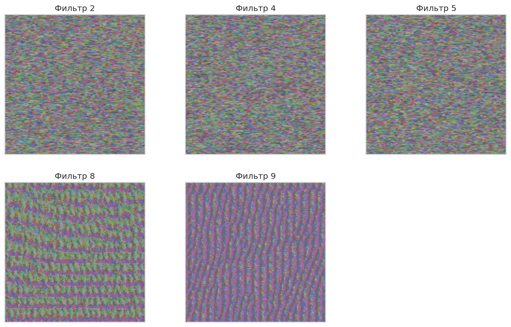
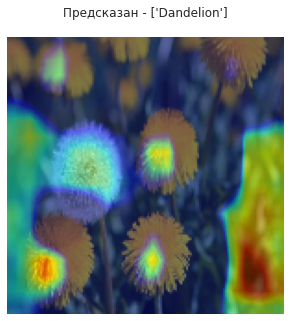

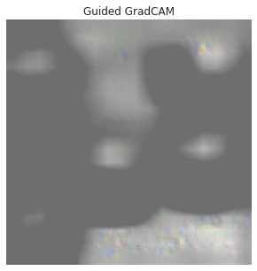
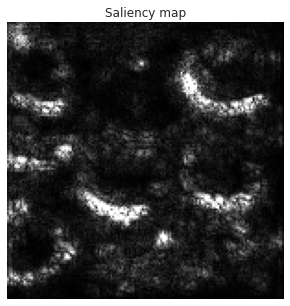
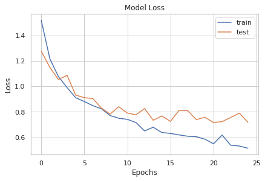
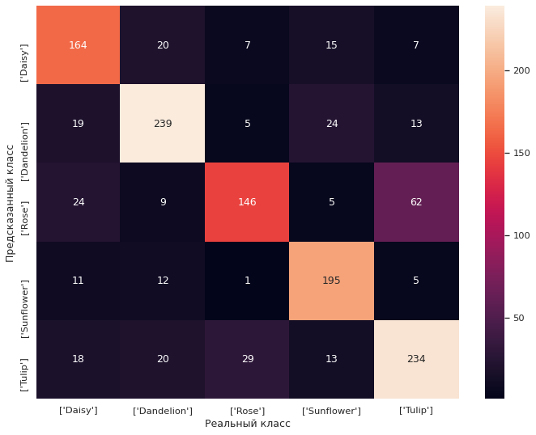
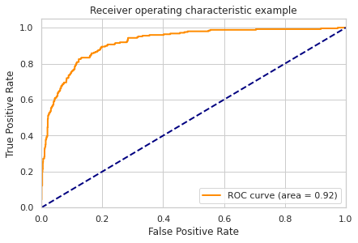
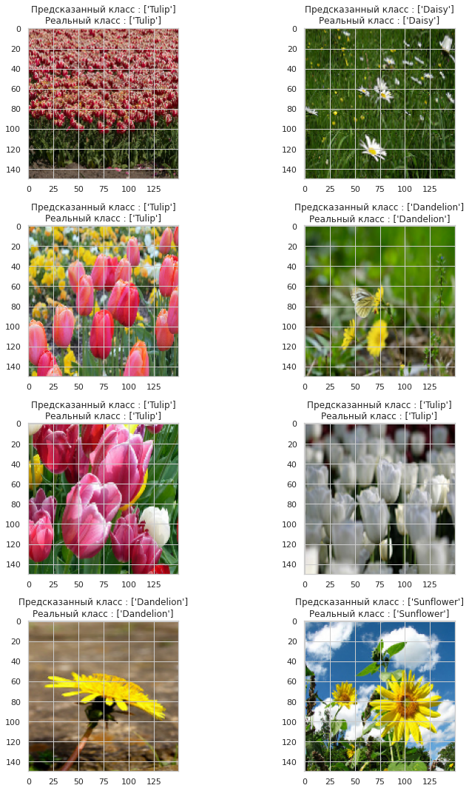
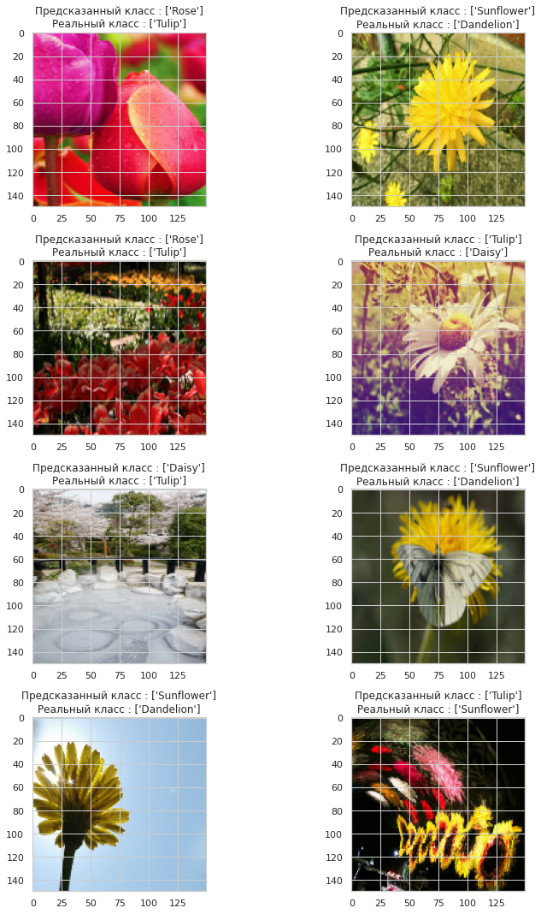
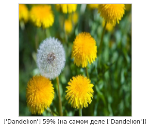
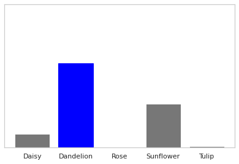
